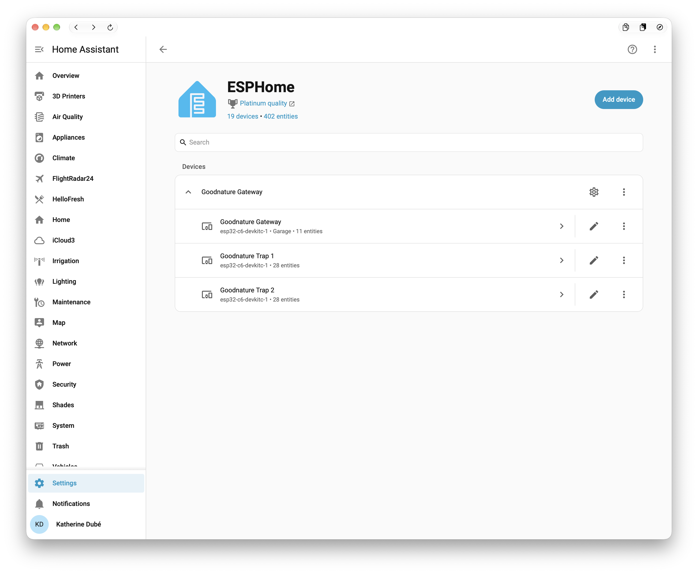
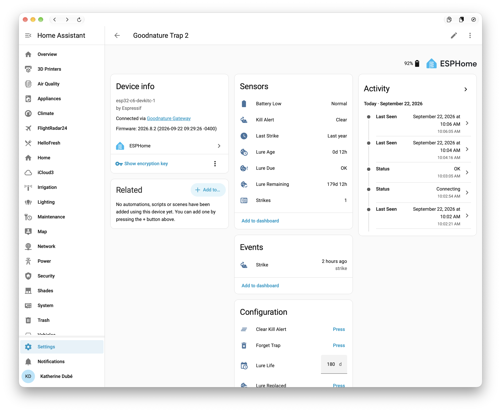
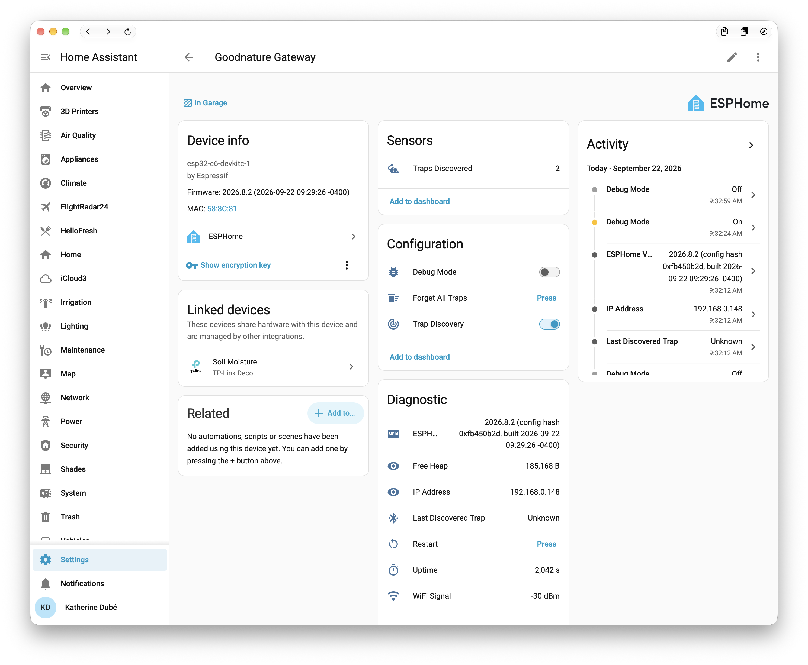

# ESPHome Goodnature BLE Gateway

Monitor [Goodnature](https://goodnature.co.nz) A24 and Mouse Trap traps in Home Assistant using an ESP32-C6 running [ESPHome](https://esphome.io). Deploy the gateway near your traps and it finds them on its own, tracks strikes, battery and consumables, and exposes **each trap as its own Home Assistant device**. Fully local, no cloud, no app.

> **Status: untested on hardware.** The protocol layer is ported from the
> [ha-goodnature](https://github.com/codyc1515/ha-goodnature) Home Assistant
> integration and covered by host-side unit tests, and the firmware compiles
> for the ESP32-C6, but it has not yet been run against a real trap. Expect
> to iterate with a trap in hand. Issues with debug logs are welcome.

## How it works

Goodnature traps carry a Bluetooth Low Energy radio that the official app uses. This project reimplements that protocol as a native ESPHome component, modelled on [esphome-subzero-ble](https://github.com/kedube/esphome-subzero-ble): one **hub** component owns a fixed set of **trap slots**, and every active slot is a Home Assistant sub-device with a full set of entities. Only the slots that hold a trap are registered, so Home Assistant shows the traps you own and nothing more.

- **Discovery is automatic.** The hub listens to all BLE advertisements, recognises Goodnature traps by their service UUIDs, `GN` local name and Nordic manufacturer data, and binds each new trap to the first free slot. Bindings are stored in flash, so a trap keeps the same Home Assistant device across gateway reboots. A C20 is identified by the serial in its advertisement, so it keeps its slot even if its Bluetooth address changes; the A24 has no serial in its advertisement and is tracked by address.
- **Two trap families.** The **A24** is the CO2-powered rat and stoat trap: it sleeps, wakes to advertise in a burst when it fires, and speaks Goodnature's original GATT services. The rechargeable **Mouse Trap** (called "C20" in the protocol notes and the reference integration) advertises continuously and talks over a Nordic UART service. The gateway tells them apart from the advertisement and shows the family in each trap's **Model** sensor. The CO2 entities only apply to the A24.
- **Passive first.** The Mouse Trap puts its serial and lifetime strike count in its advertisement, so strikes are seen without connecting; battery percentage, armed and charging state come from the scheduled poll. The A24 Chirp wakes and advertises in a burst when it fires; the gateway counts bursts as strikes until it has read the trap's own counter.
- **Active when it can.** On a schedule (default every 15 minutes), after a detected strike, or when you press a button, the gateway connects to the trap over GATT, syncs its clock, and reads the counters, battery and identity. A24 traps sleep between events and can only be reached while awake, so those polls happen opportunistically when the trap is heard.
- **Consumables are tracked on the gateway.** Lure (donut) life and CO2 shots are not available over BLE, so the gateway keeps its own timers: a **Lure Replaced** button starts the lure clock, a **CO2 Canister Replaced** button anchors the shot counter, and both survive reboots.

## Requirements

- An **ESP32-C6** board. The shipped `goodnature-gateway.yaml` targets `esp32-c6-devkitc-1`; any C6 board works if you change `board:`. Other ESP32 variants with BLE (S3, C3, classic) should also work with the matching `esp32:` block, but only the C6 has been compiled and sized here.
- **ESPHome 2025.12.0 or newer.** This is the minimum version needed to build the firmware; `goodnature-gateway.yaml` sets `min_version: 2025.12.0` and ESPHome refuses to compile on anything older. Sub-device support landed in ESPHome 2025.6, but the component also relies on the App and API internals as of 2025.12. The project is developed and tested against ESPHome 2026.8.
- **Home Assistant 2025.6 or newer** for sub-devices to appear as separate devices.
- Home Assistant with the **ESPHome integration**.

## Getting started

### 1. Install ESPHome

```bash
python3 -m venv esphome-venv
source esphome-venv/bin/activate
pip install esphome
esphome version   # must be 2025.12.0 or newer
```

If you already have ESPHome, check it is at least **2025.12.0**; `pip install --upgrade esphome` brings it up to date. The Home Assistant ESPHome add-on works too, as long as it is on 2025.12 or newer.

### 2. Configure

Clone this repository. `goodnature-gateway.yaml` is the complete gateway configuration and never needs editing for a normal setup. It includes two files you create from the examples:

```bash
cp settings-example.yaml settings.yaml
cp secrets-example.yaml secrets.yaml
```

- **`settings.yaml`** holds every tunable as a substitution: device name and area, board, number of trap slots, poll interval, lure life, CO2 canister size, offline timeouts, log level. The defaults are sensible. `max_traps` is only a ceiling; Home Assistant sees one trap device per slot in use.
- **`secrets.yaml`** holds Wi-Fi, API encryption key, OTA password and fallback hotspot credentials.

Both files are git-ignored. To build the component from git instead of the local checkout, swap the `external_components` source for the `github://` line that is commented out in `goodnature-gateway.yaml`.

### 3. Flash

Set the serial port in `settings.yaml` (`upload_port`, for example `/dev/cu.usbmodem1101` on macOS or `/dev/ttyACM0` on Linux) and use the Makefile:

```bash
make flash          # compile and flash over USB on upload_port (prompts if it is empty)
make logs-serial    # follow the log over USB
make ota            # later: compile and update over the air to ota_address
make logs           # follow the log over the network
```

Or call ESPHome directly; the Makefile only adds the `--device` flag for you:

```bash
esphome run goodnature-gateway.yaml --device /dev/cu.usbmodem1101
esphome run goodnature-gateway.yaml --device goodnature-gateway.local
esphome logs goodnature-gateway.yaml
```

`upload_speed` (esptool baud, default 460800) and `ota_address` (hostname or IP the gateway is reached at once on Wi-Fi, default `<device_name>.local`) also live in `settings.yaml`. They are passed into the YAML as `esphome.platformio_options.upload_speed` and `wifi.use_address`, so they apply however you invoke ESPHome. The serial port itself cannot be set in the YAML (ESPHome's native ESP-IDF build ignores `upload_port`), which is why the Makefile passes it as `--device`. Set `ota_address` to the IP if you use `manual_ip` or mDNS does not reach the gateway.

The YAML uses its own partition table (`partitions.csv`) with 1.94 MB app slots instead of ESPHome's 1.75 MB default, because the firmware is large. A partition table only changes on a USB flash; OTA updates keep whatever table the gateway has and work as long as the image fits. The first USB flash with the new table also moves the settings area, so the gateway forgets its traps once and rediscovers them.

### 4. Add to Home Assistant

Home Assistant discovers the gateway on the network; accept it under **Settings → Devices & Services** and enter the API encryption key from `secrets.yaml`. You get one device for the gateway plus one device per slot in use, named **Goodnature Trap 1** … **Goodnature Trap N**. A fresh gateway shows a single empty **Goodnature Trap 1** until it finds a trap. Each further trap it discovers takes the next slot and the gateway restarts a few seconds later so Home Assistant gains that device; forgetting the last trap shrinks the list the same way.



*The ESPHome integration page: the gateway plus one device per trap slot in use.*

### 5. Deploy

Power the gateway near the traps and wait. When a trap advertises, the log shows:

```
[I][goodnature_ble] Discovered Goodnature A24 at C0:FF:EE:12:34:56 (RSSI -71), assigned to slot 1
```

and the **Goodnature Trap 1** device fills in. Rename the device in Home Assistant to something like "Shed Trap"; the name you choose is kept. Slots fill in order, so a trap keeps its slot until you press **Forget Trap**. An A24 that is asleep will not be seen until it fires or is woken (shaking it or opening the app nearby wakes it).

## Configuration

Every option below is a substitution in `settings.yaml` and is passed through to the `goodnature_ble:` block in `goodnature-gateway.yaml`. If you write your own YAML, put them on `goodnature_ble:` directly.

| Option | Default | Effect |
|---|---|---|
| `time_id` | `sntp_time` | A `time:` component. Needed for lure timers, "Last Strike" timestamps, and syncing the trap's clock. Set in the gateway YAML, not a substitution. |
| `max_traps` | `8` | Ceiling on the number of slots compiled in. Each slot costs ~28 entities of RAM; 8 is comfortable on a C6. Only slots holding a trap are registered with Home Assistant, so leave headroom here. |
| `slot_name_prefix` | `Goodnature Trap` | Device names are `<prefix> <n>`. |
| `poll_interval` | `15min` | Minimum time between GATT polls of the same trap. `0s` disables scheduled polling (buttons still work). |
| `lure_life_days` | `180` | Default lure life. Each trap also has a **Lure Life** number to override it. |
| `co2_capacity` | `24` | Shots per CO2 canister (A24). |
| `co2_low_threshold` | `4` | **CO2 Low** turns on at or below this many shots. |
| `offline_timeout_a24` | `24h` | **Online** turns off when an A24 has not been heard for this long. |
| `offline_timeout_c20` | `15min` | Same for the C20, which advertises continuously. |
| `write_time_on_connect` | `true` | Send the current time to the trap on each connection, as the app does. |
| `discovery` | `true` | Initial state of the **Trap Discovery** switch. |
| `auto_acknowledge` | `false` | After a poll that finds the kill alert raised, queue **Clear Kill Alert** on the trap automatically. Home Assistant still sees the alert and the **Strike** event first. |
| `a24_battery_empty_raw`, `a24_battery_full_raw` | `0`, `0` | Map the A24's raw battery value to a percentage once you know the raw readings for a flat and a fresh battery. `0/0` leaves it disabled. |
| `a24_battery_low_percent` | `15` | **Battery Low** threshold for the calibrated A24 percentage. |
| `hub_entities` | `true` | Create the gateway-level entities listed below. Gateway YAML only. |

`settings.yaml` also carries `device_name`, `friendly_name`, `device_description`, `device_area`, `board`, `flash_size`, `upload_port`, `upload_speed`, `ota_address`, `log_level` and `ble_max_connections` for the rest of the configuration.

The component needs `esp32_ble_tracker` (scanning) and reserves one connection slot in `esp32_ble`. Running `bluetooth_proxy` alongside is fine if you leave it a slot.

## Entities

### Per trap (sub-device)



*A Mouse Trap sub-device with its sensors, Strike event and configuration buttons.*

| Entity | Type | Notes |
|---|---|---|
| **Strikes** | sensor, total increasing | Mouse Trap: the number of kill (TRIGGER) events in the trap's own striker log, re-read on every poll; test fires are not counted. A24: `D20D` over GATT; until it is read, strikes are inferred from advertisement bursts and persisted. |
| **Kill Alert** | binary, occupancy | Mouse Trap: kill detected state from the poll. The advertisement's "strikes available" bit, which is unverified, can raise it but never clears it. A24: unacknowledged kills (`displayed > read`). |
| **Strike** | event | Fires `strike` when the counter increases, or `test_fire` when a C20 striker event reports a manual fire. Use this for automations instead of watching the counter. |
| **Last Strike** | sensor, timestamp | Mouse Trap: the trap's own timestamp on its last kill event, so it depends on the trap's clock at the time. A24: from the strike record; otherwise the moment the counter was seen to increase. |
| **Battery** | sensor, % | Mouse Trap: from the UART battery-level response, so it refreshes on each poll (`poll_interval`, default 15 min); the last value is kept across gateway restarts. The advertisement does not carry a percentage. A24: only with the `a24_battery_*_raw` calibration. |
| **Battery Low** | binary, battery | Mouse Trap: battery state from the advertisement and the poll (LOW, CRITICAL or NOT_CONNECTED). A24: calibrated percentage at or below `a24_battery_low_percent`. |
| **Battery Voltage Raw** | sensor, diagnostic, disabled | A24 `FAD1` raw value; units unknown. Stays `unknown` on a Mouse Trap. |
| **Charging**, **Armed** | binary, diagnostic | Mouse Trap charging and activated state from the poll, kept across gateway restarts. Not registered on an A24. |
| **Lure Age**, **Lure Remaining** | sensor, days | From the **Lure Replaced** timestamp and **Lure Life**. |
| **Lure Due** | binary, problem | On when Lure Remaining ≤ 0. |
| **CO2 Shots Remaining** | sensor | A24 only: `co2_capacity` minus strikes since **CO2 Canister Replaced**. `unknown` on a Mouse Trap. |
| **CO2 Low** | binary, problem | A24 only: on at or below `co2_low_threshold`. |
| **Online** | binary, connectivity | Heard within the offline timeout for its model. |
| **Signal Strength**, **Last Seen** | sensor, diagnostic | Republished at most every 30 s. |
| **Model**, **Serial Number**, **Firmware**, **MAC Address**, **Status** | text, diagnostic | Status is one of `Unassigned`, `Discovered`, `Waiting for trap`, `Connecting`, `OK`, `Test fire sent`, `Alert cleared`, `Failed: …`. |
| **Last Advertisement**, **Last Frame** | text, diagnostic, disabled | Raw hex captures, populated only while the gateway's **Debug Mode** switch is on. Advertisement is `adv|scan_response`; Frame is `UUID:hex` for A24 reads or `UART type/subtype:hex` for Mouse Trap frames. |
| **Lure Life** | number, days | Per-trap override of `lure_life_days`. |
| **Poll Now** | button | Connect and read everything now. On a Mouse Trap this also replays the whole striker log to resync **Strikes** (about 12 s); routine polls only ask for events since the last one. |
| **Lure Replaced**, **CO2 Canister Replaced** | button | Reset the consumable timers. The CO2 button does nothing on a Mouse Trap. |
| **Clear Kill Alert** | button | A24: acknowledge kill/event pointers and write control `0x02`. Mouse Trap: `SetCommand(CLEAR)`. |
| **Test Fire** | button | A24: control `0x05` flow. Mouse Trap: `SetCommand(FIRE)`. **This fires the trap.** |
| **Forget Trap** | button | Unbind the slot so it can take a new trap. |
| **Log Debug Info** | button | Dump the slot's full internal state to the log at INFO. |

A slot does not know which model it will hold until discovery, so a free slot has the full entity set. Once a slot is bound, the next restart registers only the entities that apply to its trap: a Mouse Trap loses **CO2 Shots Remaining**, **CO2 Low**, **CO2 Canister Replaced** and **Battery Voltage Raw**; an A24 loses **Charging** and **Armed**. When a slot's model changes, or a slot comes into or out of use, the gateway restarts itself a few seconds later, and Home Assistant adds or removes the affected entities on reconnect.

When a trap is first discovered the lure and CO2 timers start from that moment, on the assumption that a newly deployed trap was just serviced. Press the two "Replaced" buttons if that is not the case.

### Gateway device



*The gateway device: trap count, discovery and debug switches, and the diagnostics.*

| Entity | Notes |
|---|---|
| **Traps Discovered** | Number of slots in use. The gateway registers exactly this many trap devices (at least one), restarting when the number changes. |
| **Last Discovered Trap** | MAC of the most recently bound trap. |
| **Trap Discovery** | Switch. Turn off once your traps are bound so a neighbour's trap cannot take a slot. State is restored across reboots. |
| **Debug Mode** | Switch, off by default. Logs every advertisement that looks Goodnature-like (Nordic manufacturer data, vendor UUIDs, `GN` name) with raw bytes at INFO, rate-limited to one per device per 10 s; dumps the GATT table on every connection instead of only the first; and populates the raw capture text sensors. |
| **Forget All Traps** | Unbinds every slot. |
| **Gateway Version** | Text, diagnostic. Release version of this firmware (`esphome.project.version` in the YAML), also shown as the device's firmware version on its Home Assistant device page. |

Plus the usual Wi-Fi, uptime, free heap, ESPHome version and restart entities from the YAML.

## Debugging BLE data and decoding the protocol

`tools/gateway_inspect.py` talks to the gateway over the same native API Home Assistant uses, so nothing needs a serial cable:

```bash
make states                      # every entity, grouped by device, as Home Assistant sees it
make capture                     # Debug Mode on for 60 s: decoded advertisements, GATT tables, UART frames, logs
make capture SECONDS=180 POLL=1  # longer, and press Poll Now on every slot first
tools/gateway_inspect.py decode "UART 10/01:e46cb26a01000104000000000000"   # decode a pasted value offline
tools/gateway_inspect.py press "Test Fire" --device "Goodnature Trap 1"      # any button, by name
```

**Poll Now** replays the trap's entire striker-event log, so `make capture POLL=1` streams every strike the trap remembers. `capture` prints each raw advertisement and frame followed by a `->` line with the decoded fields, using the same layouts as `protocol.cpp`. Fields that are not understood yet are shown raw (`byte5`, `byte8` of the Mouse Trap advertisement); the gateway also logs `advertisement bytes changed` whenever they move, so plugging in the charger, opening the tray or getting a strike while a capture runs is how those get decoded. Keep the decoders in `tools/gateway_inspect.py` and `protocol.cpp` in step.

### Verifying kill detection

No real kill has been observed through this gateway yet, so the first one is worth watching. With a Mouse Trap that is armed and in range:

1. Start `make capture SECONDS=300` so Debug Mode is on and every advertisement change and UART frame is decoded.
2. Trip the trap with a stick or pencil, never a finger. The striker resets itself.
3. Within a few seconds the log should show `advertisement bytes changed` (if the trap signals kills in its advertisement at all) followed by `polling now to see what changed`, then the poll's device state with `kill DETECTED` and a striker event with source `TRIGGER`.
4. In Home Assistant, **Strikes** goes up by one, **Last Strike** shows the trap's time, the **Strike** event fires with type `strike`, and **Kill Alert** turns on.
5. Press **Clear Kill Alert**; the next poll should read `kill CLEARED` and the alert turns off. With `auto_acknowledge: true` this happens by itself.

If the advertisement did not change, the kill is only noticed at the next scheduled poll (`poll_interval`); please attach the capture to an issue either way, since it decodes bytes 5 and 8 of the advertisement.

### First contact with a new trap

Suggested order when a trap is not recognised or a value looks wrong:

1. Flash, then turn on **Debug Mode** on the gateway device. Follow the log with `esphome logs goodnature-gateway.yaml`.
2. Wake the trap. Every Goodnature-like advertisement is logged as `ADV <model|unclassified> [MAC] ... raw adv=... scan_rsp=...`. If the trap shows up as `unclassified`, the classifier needs its UUIDs added; the raw bytes in that line are what to report.
3. When the gateway connects, the log prints the full GATT table (`service ... char ... props RW-N-`). Compare it with [docs/ble-protocol.md](docs/ble-protocol.md); any characteristic that is missing or has different properties explains a skipped read.
4. Enable the **Last Advertisement** and **Last Frame** entities on the trap's device to capture bytes from Home Assistant history without a serial cable.
5. Press **Log Debug Info** whenever a value looks wrong; it prints every internal field the gateway holds for that slot.
6. Turn **Debug Mode** off afterwards; it keeps a per-address log rate limit but is still noisy with a C20 nearby.

## Troubleshooting

| Symptom | What it means |
|---|---|
| Nothing discovered | The trap is asleep (A24) or out of range. Wake it by firing a test shot from the app or shaking it, and check RSSI in the log at `DEBUG`. Make sure **Trap Discovery** is on. |
| `all N slots are in use` in the log | More traps in range than `max_traps`. Raise `max_traps` and reflash, or turn discovery off and forget any slot you do not want. |
| Status `Failed: connect failed` on an A24 | The trap went back to sleep before the connection opened. Normal occasionally; the gateway backs off (1, 2, 4 … 30 min) and retries on the next advertisement. |
| Status `Failed: timeout` | A GATT session took longer than 45 s. Usually a range problem. |
| Strikes jumps after the first poll | Expected for the A24: inferred burst counts are replaced by the trap's own counter as soon as it is read. |
| Mouse Trap **Battery** is stale | It only updates on a poll. Press **Poll Now** or shorten `poll_interval`. If it ever reads a small single digit, that is the advertisement's battery *state* leaking through; report it with a `make capture`. |
| Lure sensors `unknown` | No time source yet. Check `time:` and that the gateway has internet access for SNTP, or point `sntp` at Home Assistant. |
| A slot device shows old values after **Forget Trap** | Numeric sensors are set to `unknown` and text sensors cleared, but Home Assistant keeps history. |

Turn up logging for a capture to attach to an issue:

```yaml
logger:
  level: DEBUG
  logs:
    goodnature_ble: DEBUG
    goodnature_ble.trap: DEBUG
    goodnature_ble.conn: DEBUG
```

## Project layout

| Path | Contents |
|---|---|
| `goodnature-gateway.yaml` | Complete gateway config. Never needs editing. |
| `Makefile` | `make flash`, `make ota`, `make logs`, `make test`; reads the port and OTA address from `settings.yaml`. |
| `settings-example.yaml` → `settings.yaml` | Your tunables (substitutions). |
| `secrets-example.yaml` → `secrets.yaml` | Wi-Fi, API key, OTA and hotspot credentials. |
| `components/goodnature_ble/` | The ESPHome external component (Python codegen + C++). |
| `tests/` | Host-side protocol tests, `./tests/run_tests.sh`. |
| `tools/gateway_inspect.py` | API client for `make states` / `make capture`; decodes captures. |
| `docs/ble-protocol.md` | Protocol reference. |

## Development

- `components/goodnature_ble/protocol.{h,cpp}` is plain C++ with no ESPHome dependency: UUIDs, advertisement parsing, the C20 UART framing (CRC16-CCITT, byte escaping, reassembly) and payload decoders.
- `tests/run_tests.sh` builds and runs the protocol tests with the host compiler.
- Releases use an `x.y` version set in `esphome.project.version` in `goodnature-gateway.yaml`. To cut a release, bump it, commit, and tag the commit `vx.y`. Home Assistant displays the value as the gateway's firmware version and the **Gateway Version** entity reports it.
- `goodnature_hub` does discovery and scheduling, `goodnature_trap` holds per-slot state and entities, `goodnature_connection` is the scripted GATT session on top of ESPHome's `BLEClientBase`.
- Slot sub-devices and their entities are created and configured by the component's codegen but deliberately not registered from `main.cpp`. `GoodnatureHub::setup()` registers the first N with the App at boot, where N is the highest slot with a trap bound in flash (at least 1), so the API only reports those. Because the App tables cannot change after boot, discovering a trap into an unregistered slot or forgetting the last trap schedules a restart. The App's static device and entity tables are still sized for `max_traps` (the codegen adjusts `ESPHOME_DEVICE_COUNT`), which is what lets N grow without a reflash. Because the API's device-info message always carries `ESPHOME_DEVICE_COUNT` entries, the hub pads the unused ones with a duplicate of slot 1's device, which Home Assistant merges by identifier; without that, hidden slots show up as an unnamed second "gateway" device. This leans on three ESPHome internals, the platform `setup_<x>_core_()` helpers, the `ESPHOME_DEVICE_COUNT` define and that fixed-size device list, so check them when bumping `min_version`.

See [docs/ble-protocol.md](docs/ble-protocol.md) for the protocol reference.

## Limitations and unknowns

- Sub-device names are fixed at compile time (`Goodnature Trap N`). Rename them in Home Assistant; runtime renaming is not supported by ESPHome's API.
- A24 battery: only a raw `FAD1` value is available, with unknown units. Read **Battery Voltage Raw** on a fresh and a flat battery and enter both in `settings.yaml` to get a percentage.
- A24 `D20D` is treated as the total strike counter, following the reference integration. If it turns out to be a "kills since last reset" counter, **Strikes** will still be monotonic within a reset window but may go backwards after **Clear Kill Alert**; the gateway logs a warning if it sees the counter decrease.
- Mouse Trap strike counting is incremental: a routine poll asks the trap for striker events since the last completed window (with a two-minute overlap, deduplicated by the trap's timestamps), and the whole log is replayed once a day, on **Poll Now**, and whenever the count is not yet known. A full replay takes the trap about 12 s. Events stamped before 2017 (trap clock unset at the time) are not counted.
- On one trap the kill event carried the trap's own timestamp of 19 July 2025 while the app showed 11 April 2025. The bytes decode unambiguously, so the difference is between the trap's clock at the time and whatever the app recorded; **Last Strike** shows the trap's value.
- Mouse Trap advertisement bytes 5 and 8 do not match the reference integration's layout (see [docs/ble-protocol.md](docs/ble-protocol.md)); armed and charging state therefore only come from the poll, and the advertisement's "strikes available" bit can raise **Kill Alert** but is not trusted to clear it. Any change in those bytes triggers an immediate poll (at most once a minute), so a kill the trap does signal there is picked up within seconds.
- C20 UART byte escaping is documented for the frame delimiters only. This implementation also escapes a literal `0xB2`; if a real trap rejects such a frame, that assumption is wrong.
- Slot bindings, counters and consumable timers are written through ESPHome's preferences. Bindings, button presses and new strikes are flushed to flash immediately; last-seen times ride the 60 s periodic sync.
- Whether Bluedroid fires `WRITE_CHAR_EVT` for write-without-response characteristics is handled either way (a timeout advances the session), but it makes a failed Nordic UART write slower to detect.

## License and acknowledgements

Provided as-is for personal, non-commercial use, with no affiliation with or endorsement by Goodnature Limited. Protocol details come from the [ha-goodnature](https://github.com/codyc1515/ha-goodnature) Home Assistant integration by codyc1515, reverse engineered from the Goodnature app and BLE captures. The hub/sub-device architecture follows [esphome-subzero-ble](https://github.com/kedube/esphome-subzero-ble). AI assistance was used for code and documentation.
